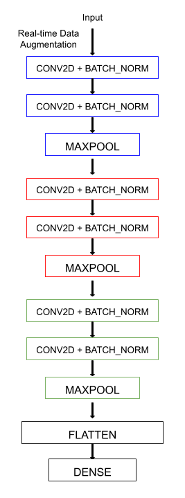

# Improving Model Performance with Batch Normalization and Data Augmentation

With thousands of trainable parameters, deep neural networks are prone to overfitting the training set. Regularization restricts the freedom of the model. Consequently, this causes the model to less likely fit the noise of the training data and improve its ability to generalize. In this notebook, we show that two types of reguralization techniques improve the performance of a learning model. In particular, we will build a multiclass image classifier implemented with data augmentation and batch normalization. Our model is made up of convolutional, max pooling, flatten, and dense layers arranged as follows:

We will make use of the CIFAR-10 dataset collected by Alex Krizhevsky, Vinod Nair, and Geoffrey Hinton from the University of Toronto. Without data augmentation and batch normalization, our baseline model achieves a validation accuracy of around $70\%$. With the mentioned regularization techniques, our model achieves $85\%$ accuracy on our test set.

[Click here](https://github.com/faerlinpulido/improving_model_performance_with_batch_normalization_and_data_augmentation/blob/master/notebook.ipynb to go directly to the project's python notebook. 

By Faerlin Pulido
